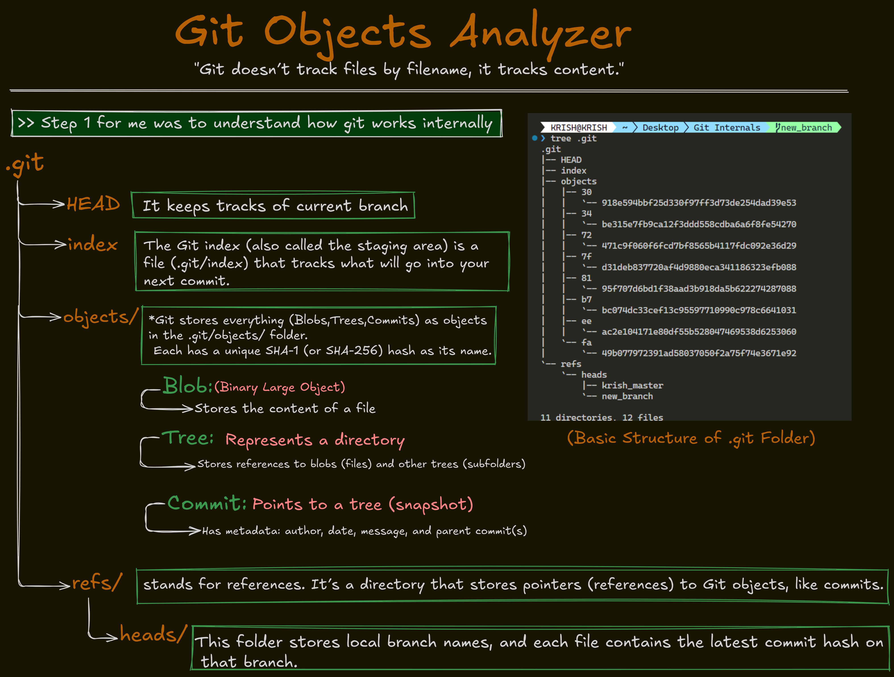
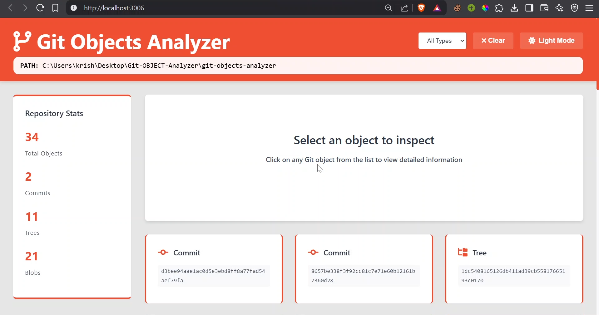

# Git Objects Analyzer




A powerful tool to analyze Git objects (blobs, trees, commits) and generate an interactive HTML report with advanced filtering and search capabilities.

## ✨ Key Features

### 🔍 Comprehensive Git Object Analysis
- View all Git objects in your repository
- Includes commits, trees, and blobs
- Shows SHA hashes, dates, authors, and paths

### 🎨 Beautiful Interactive UI
- Modern, responsive design that works on all devices
- Color-coded object types for quick identification
- Font Awesome icons for better visual cues
- Clean, professional interface

### 🔢 Built-in Statistics Dashboard
- Total objects count
- Breakdown by type (commits, trees, blobs)
- Visual cards with counts for each category

### ⚡ Powerful Filtering
- Filter by object type:
  - **Commits** (with author information)
  - **Trees** (directory structures)
  - **Blobs** (file contents)
- One-click filtering with visual active state

### 🔎 Advanced Search
- Search across all fields:
  - Path names
  - Author names (for commits)
  - SHA hashes
- Real-time results as you type
- Case-insensitive matching

### 🗂 Smart Sorting
- Sort by any column:
  - SHA hash
  - Object type
  - Date (chronological/reverse)
  - Author name
  - Path
- Toggle between ascending/descending order

### 📊 Informative Empty States
- Friendly messages when no results match
- Clear indicators when filters are active
- Visual feedback for all interactions

## 📦 Installation

```bash
npm install -g git-objects-analyzer